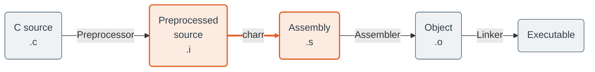
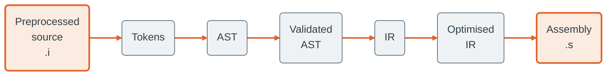

<picture>
  <source media="(prefers-color-scheme: dark)" srcset="assets/charr-dark.svg">
  
</picture>

A compiler for a large subset of the C programming language, implemented in OCaml. Inspired by the book [Writing a C Compiler](https://nostarch.com/writing-c-compiler), written by Nora Sandler.

## Supported C Language Features

### Expressions & Operators
- Integer constants
- Unary operators: `-`, `~`
- Binary arithmetic operators: `+`, `-`, `*`, `/`, `%`
- Logical operators: `&&`, `||`, `!`
- Bitwise operators: `&`, `|`, `^`, `<<`, `>>`
- Relational operators: `==`, `!=`, `<`, `<=`, `>`, `>=`
- Conditional expressions: `a ? b : c`
- Comma operator

### Statements & Control Flow
- `return`
- `if` / `else`
- Compound statements (`{ ... }`)
- Loops: `for`, `while`, `do … while`
- `break` and `continue`
- `switch`, `case` and `default`
- `goto` and labelled statements

### Variables & Scope
- Local variable declarations
- Assignment: `=`
- Compound assignment: `+=`, `-=`, `*=`, `/=`, `%=`
- Bitwise compound assignment: `&=`, `|=`, `^=`, `<<=`, `>>=`
- Lexical scoping rules
- Semantic analysis for:
  - Undeclared variables
  - Invalid control-flow usage

### Functions
- Definition of functions beyond `main`
- Function calls
- Argument passing
- Return values
- Type checking for function calls
- System V x86-64 calling convention

### File Scope Declarations
- File-scope variables
- `extern` and `static` storage-class specifiers
- Correct handling of:
  - Linkage
  - Storage duration
- Code generation for global data

### Optimisation
- IR optimisations:
  - Constant folding
  - Dead store elimination
  - Unreachable code elimination
  - Copy propagation

## In Progress Features

### Types Beyond `int`
- `long` integers
- Unsigned integer types
- Floating-point (`double`)
- Pointers: `*`, `&`
- Arrays and pointer arithmetic
- Characters and strings
- `void`, `sizeof`, and dynamic memory allocation
- Structures (`struct`, `.`, `->`)

### Optimisation
- Register allocation
  - graph colouring
  - Register coalescing

## Unplanned Features

A line must be drawn somewhere, and it is therefore unlikely that the following important C language features will be implemented:
- Function pointers
- Variable-length argument lists
- `typedef`
- Type qualifiers like `const`

## Build and Installation

### Requirements

- Linux environment (WSL is fine)
- opam (>= 2.0)
- OCaml (via opam, >= 4.14)
- make
- GNU compiler suite (for C preprocessor and linker)

On Ubuntu, all requirements can be installed with `sudo apt install opam build-essential`

### Setup

It's recommended to create a new opam local switch in the project directory, which will install all required dependencies in an isolated environment:

```bash
git clone https://github.com/joshuanunn/charr.git
cd charr
opam switch create . -y
eval $(opam env)
opam install . --deps-only
make
```

### Testing

Check that the compiler executable works using `charr --help` or run the full regression test suite using `make test`.

## Compilation Overview

`charr` occupies the source-to-assembly stage of compilation (highlighted); preprocessing, assembling, and linking are delegated to the system toolchain.



In this compilation stage, `charr` lowers preprocessed source to assembly through lexing, parsing, semantic analysis, IR generation, optimisation, and code generation:



## License

This software is released under the MIT license [MIT](LICENSE).

## Third-party Content

This project includes test cases derived from [github.com/nlsandler/writing-a-c-compiler-tests](https://github.com/nlsandler/writing-a-c-compiler-tests), licensed under the MIT License. See [test/tests/LICENSE.third_party](test_e2e/tests/LICENSE.third_party) for details.
